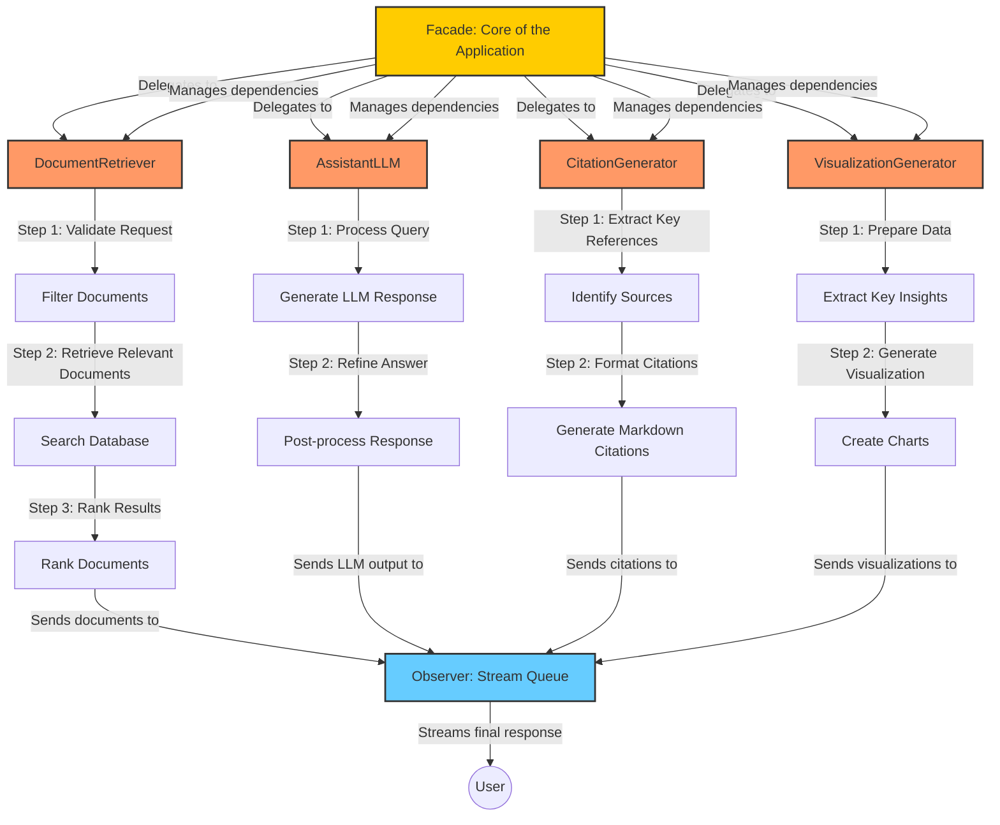

### **Explanation of Flow**
1️⃣ **Facade** receives the request and **delegates it** to Chain of Responsibility.  
2️⃣ **Chain of Responsibility** breaks the task into **sequential steps**:  
   ✅ **Filtering the request**  
   ✅ **Searching the document base**  
   ✅ **Generating an LLM-based response**  
   ✅ **Formatting citations & diagrams**  
3️⃣ **Observer** **listens** to these stages and **collects results**.  
4️⃣ **Observer streams** the final formatted Markdown back to the user.  

This architecture is highly **scalable** 🚀, **modular** 🔥, and **efficient for streaming responses** 📡.

Would you like me to enhance it with an example **Python implementation**? 😊
